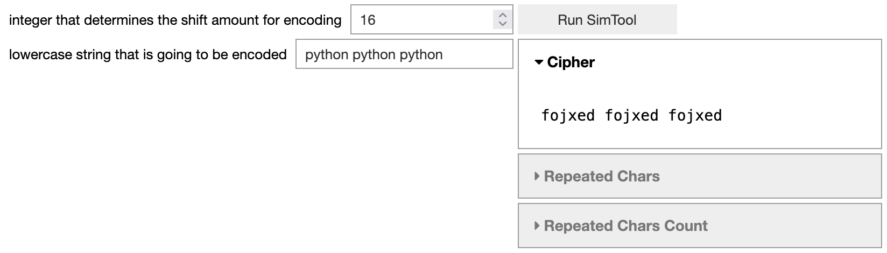
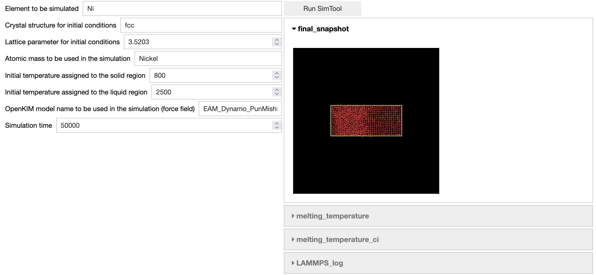

Sim2l as a Jupyter Widget
=========================

Sim2ls Default Schema
---------------------

Sim2ls (`SimTools <https://simtool.readthedocs.io/en/stable/usage/basic.html>`_) are Jupyter notebooks designed to facilitate simulations by defining input and output declarations,
as well as presenting a simulation workflow for generating outputs based on the provided inputs.

Within sim2lbuilder, there is a function called ``GetSimtoolDefaultSchema``. 
This function is responsible for generating a default schema by leveraging the description of a sim2l.
To use this function, simply pass the name of the sim2l as a parameter. The function will then return a 
Python dictionary that represents the default schema for that sim2l.

The following code snippet shows the defaulut schema for the caecipher sim2l, caecipher is a simple cipher 
that takes a string msg input and integer shift input and outputs the encrypted message with most repeated 
characters and # of repeated. 

.. code-block:: python

    from sim2lbuilder import WidgetConstructor, GetSimtoolDefaultSchema
    schema = GetSimtoolDefaultSchema("caecipher")
    schema

.. code-block:: python

    {'name': 'caecipher',
    'revision': '39',
    'inputs': {'shift_input': {'type': 'input.Integer',
    'description': 'integer that determines the shift amount for encoding',
    'value': 16},
    'values': {'type': 'input.Text',
    'description': 'lowercase string that is going to be encoded',
    'value': 'python'}},
    'outputs': {'Cipher': {'type': 'output.Text',
    'description': 'lowercase alphabetical letters'},
    'Repeated Chars': {'type': 'output.Text',
    'description': 'string of character(s) that are most used in the original input'},
    'Repeated Chars Count': {'type': 'output.Integer',
    'description': 'integer that shows the most amount of times a character appeared in input',
    'min': None,
    'max': None}},
    'layout': {'type': 'HBox',
    'children': {'inputs': {'layout': {'width': 'auto'},
        'type': 'VBox',
        'children': ['input.shift_input', 'input.values']},
    'outputs': {'type': 'VBox',
        'children': {'button': {'type': 'Button',
        'click': 'RunSimTool',
        'description': 'Run SimTool'},
        'container': {'type': 'Accordion',
        'children': ['output.Cipher',
        'output.Repeated Chars',
        'output.Repeated Chars Count'],
        'titles': ['Cipher', 'Repeated Chars', 'Repeated Chars Count']}},
        'layout': {'flex': '1'}}}}}

Next, the function ``RunSimTool`` is created. This function iterates over the values of all input widgets and executes the corresponding sim2l. 
Once the simulation is complete, the output widgets are populated with the corresponding output results.

.. code-block:: python

    from simtool import searchForSimTool, getSimToolInputs, Run

    def RunSimTool(widget, *kargs):
        stl = searchForSimTool("caecipher")
        inputs = getSimToolInputs(stl)
        for i,w in widget.inputs.items():
            inputs[i].value = w.value
        r = Run(stl, inputs)
        for outk, out in widget.outputs.items():
            with out:
                print(r.read(outk))

Finally, the function is assigned and the widget assembled. 

.. code-block:: python

    s = WidgetConstructor(schema)
    s.RunSimTool = RunSimTool
    s.assemble()
    s

Customizing the Schema
----------------------

The default schemas provided may not always include the most appropriate input or output widgets.
Therefore, it is possible to modify the schema before assembling the widget.
For instance, in the case of the sim2l ``meltingkim``, it requires an integer within a specific range. 
In such cases, the ``BoundedIntText`` widget is more suitable and can be used instead.

.. code-block:: python

    schema = GetSimtoolDefaultSchema("meltingkim")
    schema["inputs"]["Tsolid"]["type"] = 'BoundedIntText'
    schema["inputs"]["Tliquid"]["type"] = 'BoundedIntText'
    schema["inputs"]["run_time"]["type"] = 'BoundedIntText'
    schema["inputs"]["mass"]["type"] = 'Text'

this sim2l also returns an image as an output, you have the option to use an ``Image`` widget to 
customize the size of the rendered image according to your preferences.

.. code-block:: python

    schema["outputs"]["final_snapshot"]["type"] = 'Image'
    schema["outputs"]["final_snapshot"]["layout"] = {"width" : '50%'}

To utilize the image widget, a small modification is needed in the ``RunSimTool`` function. 
Specifically, the PIL objects should be transformed into bytes, as demonstrated in the code snippet below.

.. code-block:: python

    def RunSimTool(widget, *kargs):
        stl = searchForSimTool("meltingkim")
        inputs =getSimToolInputs(stl)
        for i,w in widget.inputs.items():
            inputs[i].value = w.value
        r = Run(stl, inputs)
        for outk, out in widget.outputs.items():
            if outk == "final_snapshot":
                img = r.read(outk)
                byte_io = io.BytesIO()
                img.save(byte_io, img.format)
                out.format = img.format
                out.value = byte_io.getvalue()
            else: 
                with out:
                    print(r.read(outk))

Exporting widgets
-----------------

The widget can be exported as a Python script by providing the ``format`` parameter as ``"file"`` when constructing the Widget. 
This will generate a Download link that allows you to obtain the file.

.. code-block:: python

    s = WidgetConstructor(schema, format="file")
    s.RunSimTool = RunSimTool
    s.assemble()
    s

The exported Python script can be imported later to render the same results.
By executing the script, you can reproduce and visualize the same outcomes

.. code-block:: python

    import MyWidget
    MyWidget.MyWidget()

For more examples visit the notebook `here <https://github.com/denphi/sim2lbuilder/blob/main/examples/st4pcpbt.ipynb>`_

Publishing the App on nanoHUB
-----------------------------

Open your web browser and go to the following `URL: <https://nanohub.org/whypublish/whypublishdeployworkflow>`_. 
This is a basic tutorial that will guide you through the process of publishing Jupyter workflows.

Create a tool
^^^^^^^^^^^^^

Open another tab in your web browser and navigate to the following URL: 
`https://nanohub.org/tools/create <https://nanohub.org/tools/create>`_. If you're not already logged in,
you will need to log in using your credentials.

On the page, you will see a form where you need to provide information about your tool.
Start by entering a short description of the tool in the designated field.

Next, you will need to add your team members. There should be an option or button to add team members.
Click on it and enter the necessary details of each team member.

There might be a few other quick things you need to provide, such as additional information or settings. 
Follow the on-screen instructions to complete these steps.

When you reach the publishing options, make sure to select "Jupyter Notebook" as the preferred option.
This will ensure that your tool is published on the correct environment.

Select the correct container
^^^^^^^^^^^^^^^^^^^^^^^^^^^^

New libraries (Jupyter70) are installed on a new container, you have to request a debian10 container.
if you develop your tool on Jupyter70, submit a `ticket <https://nanohub.org/support/ticket/new>`_ 
requesting debian10 for your tool.

Develop your tool
^^^^^^^^^^^^^^^^^

Open your web browser and go to either the deprecated `jupyte60 <https://nanohub.org/jupyter60>`_ 
or  `Jupyter Notebook (202105)  <https://nanohub.org/jupyter70>`_. 
These URLs will take you to the Jupyter Notebook interface where you can start creating your app.

invoke file
^^^^^^^^^^^

All nanoHUB tools require a properly configured invoke file for successful launching, 
ensure that the invoke file loads the correct environment. `-A` options ensures that your notebook is
launched in app-mode, all code is going to be hidden and only widgets will be visible.

.. code-block:: bash

    #!/bin/sh
    /usr/bin/invoke_app "$@" -t YOURAPPNAME
        -C "start_jupyter -t -A -T @tool YOURAPPNAME.ipynb" \
        -u anaconda-7 \
        -w headless \
        -r none

For older environments like Jupyter60, certain parameters are unnecessary.

.. code-block:: bash

    #!/bin/sh
    /usr/bin/invoke_app "$@" -t YOURAPPNAME
        -C "start_jupyter -t -A -T @tool YOURAPPNAME.ipynb" \
        -u anaconda-6

