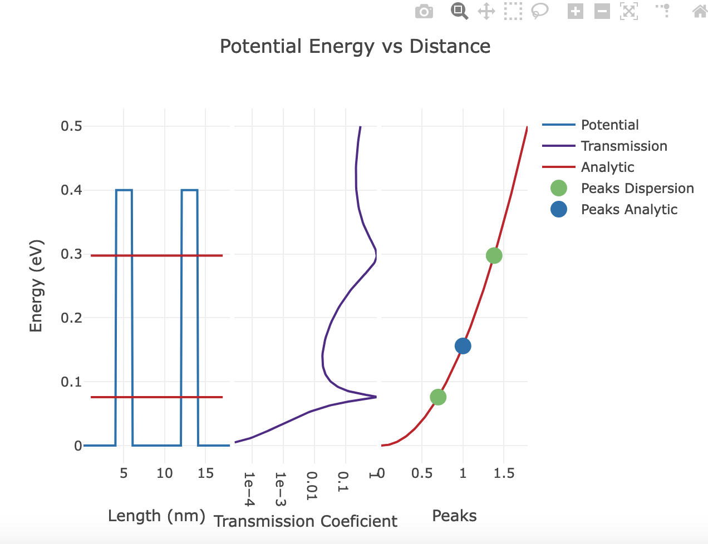

Sim2l as a Javascript Apps
==========================

Loading a Sim2ls Default Schema
-------------------------------

To acquire the default schema, you can utilize the same ``GetSimtoolDefaultSchema`` 
function from the ``sim2lbuilder`` module. This function will retrieve the default 
schema for the specified sim2l and return it as a Python dictionary.

.. code-block:: python

    from sim2lbuilder import GetSimtoolDefaultSchema, UIDLConstructor
    schema = GetSimtoolDefaultSchema("introtosimtools")

However, instead of creating a ``WidgetConstructor``, in this case, we create a ``UIDLConstructor``
object to define a web application and assemble it.
The ``UIDLConstructor`` object is responsible for constructing the necessary components 
and structures required for the web application based on the provided schema and configuration.

.. code-block:: python

    s = UIDLConstructor(schema)
    s.assemble()

This process will generate an HTML file that can be downloaded. However, it is important to note 
that for proper functionality, the HTML file needs to be correctly published on a HUB where 
Cross-Origin Resource Sharing (CORS) is allowed. If CORS is not permitted, the resulting display 
may appear similar to the image shown below. It is crucial to ensure that CORS is appropriately 
configured to enable the web application to function as intended.

By including the parameter ``jupyter_notebook_url`` during the assembly process, the nanohub-UIDL proxy will be enabled, 
and a link will be generated, this parameter requires the current url deefined by the Jupyter frontend. 
The variable ``jupyter_notebook_url`` is automatically created on the nanoHUB environment when a notebook is created.
thanks to the `appmode <https://github.com/oschuett/appmode>`_ extension. 
Including this parameter ensures the proper functioning of the web application within the nanoHUB environment and is 
really useful for developing and testing.

.. code-block:: python

    s.assemble(jupyter_notebook_url=jupyter_notebook_url)

.. image:: ../uidlliink.png

To print the description of the web application as a JSON text the following command can be seede.

.. code-block:: python

    s.Project.__json__()

Editing Simulation Parameters
-----------------------------

Expanding the parameters Tab will reveal all the inputs defined by the sim2l. 
Each web component generated utilizes the information from the schema to validate user inputs. 
This ensures that the inputs provided by the user adhere to the specified requirements and 
constraints set by the sim2l.

Running a Simulation
--------------------
By clicking on the "Simulate" button located at the bottom of the parameters section,
the simulation process will commence. All user inputs will be passed to the sim2l for execution. 
Throughout the simulation, users will receive updates regarding the status of the process,
which may include stages such as "Staging," "Running," "Archiving Results," and "Retrieving Cache." 
This feedback keeps users informed about the progress and status of the ongoing simulation.

.. image:: ../simulating.png

Sim2l Outputs
-------------

sim2lbuilder, creates a button for each output defined in the sim2l and select a default view component below are some examples

``Image`` outputs are displayed using the max width of the container using the loadHTML view.

``Boolean``, ``Integer``, ``Numbers`` outputs are displayed using the loadValuePlotly view as a point on the Y axis.
``Array``, ``List`` outputs are displayed using the loadPlotly as a list of numbers on the Y axis.
``Dict`` outputs are displayed using the loadPlotly with its first element as a list of numbers on the X axis, and its second 
element as a list of numbers on the Y axis.

``Text``, ``Tag``, ``Choice`` outputs are displayed using the loadHTML view.

Sim2lbuilder Outputs
--------------------

The outputs of the JavaScript app can be customized by modifying the 
``outputs`` attribute of the ``UIDLConstructor`` before the final code is assembled. 
Each output requires an ``id``, a ``title`` and a ``function`` that describes the view to be used for visualization.
Sim2lbuilder provides various views that can be utilized to visualize sim2l outputs. 
By selecting an appropriate view and configuring the corresponding parameters, 
you can tailor the output representation to suit your specific requirements.

loadPlotly
^^^^^^^^^^

The loadPlotly view is particularly useful for visualizing dictionary outputs. It relies on a dataset 
that describes a collection of sim2l outputs, where each key corresponds to the name of a specific sim2l output. 
To access individual elements of the dictionary, the dollar symbol "$" is used as a prefix.

Here's an example that assumes the existence of a sim2l output called "Cosine Dispersion"
with two components: ``"energy"`` and ``"well"``. Each component contains an array of numbers.

.. code-block:: python

    s.outputs = [{
        'id': 'cosanalytic',
        'title' : 'Cosine Dispersion',
        'function': 'loadPlotly',
        'dataset': {
            'Cosine Dispersion' : {
                'x': '$energy',
                'y': '$well',
                'name' : 'Cosine',
                'line' : {
                    'color' :'#ca0020'
                }
            },
        },
        'layout': {
            'title': 'Analytic Dispersion Cosine Approximation',
            'yaxis': {
                'title': '',
                'exponentformat': 'e'
            },
            'xaxis': {
                'title': '',
                'exponentformat': 'e',
                'type': ''
            },
            'showlegend': True
        },
    }]
    s.assemble()
    

In the above example, the loadPlotly view is used to visualize the "Cosine Dispersion" output. 
The "energy" and "well" components are accessed using the respective keys "$energy" and "$well" 
within the dataset. 
Additionally, because this view relies on Plotly all 
`traces parameters <https://plotly.com/javascript/reference/scatter/>`_ can be added such as 
lines and marker colors, trace type, hover info, etc..

loadPlotly view also requires a layout that describe the general layout of the visualization `(plotly layout) <https://plotly.com/javascript/reference/layout/>`_

Here's an additional example that assumes the existence of a sim2l output called "Local Density"
with three components: ``"ldos"``, ``"energy"``, and ``"length"``. Each component contains an array of numbers.

.. code-block:: python

    s.outputs = [{
        'id': 'LocalDensity3d',
        'title' : 'Local Density Surface',
        'function': 'loadPlotly',
        'dataset': {
            'Local Density': {
                'z': '$ldos',
                'x': '$length',
                'y': '$energy',
                'type': 'surface',
                'opacity' : 0.8,
                'contours': {
                    'z': {
                        'show':True,
                        'usecolormap': True,
                        'highlightcolor':"limegreen",
                        'project':{'z': True}
                    }
                },
            }
        },
        'layout': {
            'title': 'Local Density of States',
            'showlegend': True,
            'scene' : {
                'yaxis': {
                    'title': 'Energy (eV)',
                },
                'xaxis': {
                    'title': 'Length (nm)',
                },
                'zaxis': {
                    'title': 'Local Density of States at 0eV',
                }
            }
        },
    }]

for more information about 3D plots and supported parameters take a look at: 
`Scatter 3D <https://plotly.com/javascript/reference/scatter3d/>`_,
`Surface <https://plotly.com/javascript/reference/surface/>`_,
`Mesh <https://plotly.com/javascript/reference/mesh/>`_,
`Cone <https://plotly.com/javascript/reference/cone/>`_,
`Streamtube <https://plotly.com/javascript/reference/streamtube/>`_,
`Volume <https://plotly.com/javascript/reference/volume/>`_,
`Isosurface <https://plotly.com/javascript/reference/isosurface/>`_

loadMultiPlotly
^^^^^^^^^^^^^^^
The loadMultiPlotly view is similar to loadPlotly, however this view  expects an additional level in the dataset, 
for example a collection of plots where the key of the dictionary represents the name of the plot.

Here's an example that assumes the existence of a sim2l output called "Wavefunctions"
with multiple components, each component represents an energy level, for each energy two components are expected
"position" and "normalized.".

.. code-block:: python

    s.outputs = [{
        'id': 'wavefunction',
        'title' : 'TB Wavefunctions',
        'function': 'loadMultiPlotly',
        'dataset': {
            'Wavefunctions' : {
                'x': '$position',
                'y': '$normalized',
                'name' : 'wf',
                'line' : {
                }
            },

        },
        'layout': {
            'title': 'Wave-functions from tight-binding',
            'yaxis': {
                'title': '',
                'exponentformat': 'e'
            },
            'xaxis': {
                'title': '',
                'exponentformat': 'e',
                'type': ''
            },
            'showlegend': True
        },
    }]

loadSequencePlotly
^^^^^^^^^^^^^^^^^^

The loadSequencePlotly view is similar to loadMultiPlotly, but with a slight difference in how the plots are presented. 
Rather than displaying all the plots overlapped, the loadSequencePlotly view includes a slider that allows you to view the plots one by one,
in a sequential manner.

This view is particularly useful when you want to analyze a series of related plots individually, 
rather than seeing them all at once. By using the slider, you can navigate through the plots 
and focus on each one separately, providing a more interactive and controlled visualization experience.

loadTablePlotly
^^^^^^^^^^^^^^^

The loadTablePlotly view is a simple way to represent lists or values as tables using Plotly.
This view leverages `Plotly's table <https://plotly.com/javascript/table/>`_ functionality to present the data in a tabular format.

When using the loadTablePlotly view, you provide the data, which can be a list or a set of values, 
and the view will render it as an interactive table. Each value within the list or set will be
displayed in a separate table cell, allowing for easy visualization and exploration of the data.

.. code-block:: python

    s.outputs = [{
        'id': 'outputTag01',
        'title': 'outputTag01',
        'function': 'loadTablePlotly',
        'dataset': {
            'outputTag01': {
                'header': {
                    'values': '$value',
                    'fill': {'color': 'gray'}
                },
                'cells': {'values': '$value'}
            }
        },
        'layout': {
            'title': 'outputTag01'}
        }]

loadValuePlotly
^^^^^^^^^^^^^^^

The loadValuePlotly view is similar to loadPlotly, but with a slight difference in the type of input it expects.
This view is specifically designed to handle a single value, as opposed to a list of numbers or a dataset.
When using the loadValuePlotly view, you provide a single value as input, which could be numerical or non-numerical. 
The view then utilizes Plotly to present the value in a visually appealing manner.

This view is particularly useful when you want to emphasize and highlight a specific value or metric, 
providing a clear and concise representation using Plotly visualizations.

Here's an example that assumes the existence of a sim2l output called ``"outputInteger01"``, displayed on the ``y`` position

.. code-block:: python

    s.outputs = [{
        'id': 'out1',
        'title': 'Integer',
        'function': 'loadValuePlotly',
        'dataset': {
            'outputInteger01': {
                'name': 'outputInteger01',
                'mode': 'markers',
                'y': '$outputInteger01',
                'type': 'scatter',
                'marker': {'size': 20}
            }
        },
        'layout': {
            'title': 'outputInteger01'
        }
    ],
  
loadHTML
^^^^^^^^

The loadPlotly view is specifically designed for visualizing raw data or text-based outputs.
It relies on a dataset that describes an HTML tree structure, and the key "$value" is used 
to include the actual value within the tree.

This view is helpful when you want to display unprocessed data or textual information directly. 
By providing the dataset with the appropriate HTML tree structure and utilizing "$value" 
to insert the value at the desired location, you can effectively render the raw data
or text-based output in a visually appealing manner.

Here's an example that from a sim2l output called "Original System" and its content is displayed inside a <pre> tag

.. code-block:: python

    s.outputs = [{
        'id' : 'log',
        'title' : 'Log',
        'function' : 'loadHTML',
        'dataset' : {
            "Original System": {
              'type':'div', 
                'style':'padding:10px', 
                'children':[{
                    'type':'h2',
                    'textContent':'Original System'
                },
                {
                    'type':'pre',
                    'textContent':'$value'
                }]
            }
        },
        'layout' : {},
    }]

squidDetail
^^^^^^^^^^^

The SquidDetail view is not a specific visualization view itself. Instead, it serves as a trigger to open a 
pop-up window displaying the stored results on nanoHUB.org.
When utilizing the SquidDetail view, users can access and explore the detailed
results of a simulation by clicking on the respective button.
This feature allows users to further analyze and examine the simulation outcomes within nanoHUB.org.

.. code-block:: python

    s.outputs = [{
        'id': 'record',
        'title' : 'Result Record',
        'function': 'squidDetail'
    }]

For more information, explore the `nanoHUB results database <https://nanohub.org/results/>`-

Combining Outputs in a View
---------------------------

There are instances where users may wish to visualize multiple outputs within the same View.
The Sim2lBuilder library offers the capability to combine such outputs.

Here is an example illustrating the combination of outputs from a sim2l, namely "melting_temperature,"
"fraction_liquid," and "fraction_solid." All the content from these outputs can be displayed 
within a single loadValuePlotly view.

.. code-block:: python

    s.outputs = [{
        'id': 'combined',
        'title': 'combined',
        'function': 'loadValuePlotly',
        'dataset': {
            'melting_temperature,fraction_liquid,fraction_solid': {
                'text': '$melting_temperature',
                'mode': 'markers',
                'x': '$fraction_solid',
                'y': '$fraction_liquid',
                'type': 'scatter',
                'marker': {
                    'size': 20
                }
            }
        },
        'layout': {}
    }]

Describing Shapes 
-----------------

the loadMultiPlotly and loadPlotly views offer an additional option called "shapes." 
This option allows users to describe shapes over the plot, enhancing the overall visualization.

Here is an example demonstrating the usage of shapes to overlay Resonance Peaks over Potential Energies in the first plot:

.. code-block:: python
    s.outputs = [{
        'id': 'Bandstructure',
        'title' : 'Bandstructure',
        'function': 'loadPlotly',
        'dataset': {
            'Potential Energy': {
                'x': '$distance',
                'y': '$potential',
                'name' : 'Potential',
                'line' : {
                  'color' :'#0571b0'
                },
            },
            'Transmission TBM RG' : {
                'x': '$transmission',
                'y': '$energy',
                'name' : 'Transmission',
                'line' : {
                    'color' :'#542788'
                },
                'xaxis': 'x2',
            },
            'Parabolic Dispersion' : {
                'x': '$resonance',
                'y': '$energy',
                'name' : 'Analytic',
                'line' : {
                    'color' :'#ca0020'
                },
                'xaxis': 'x3',
            },
            'Peaks Dispersion' : {
                'x': '$resonance',
                'y': '$energy',
                'name' : 'Peaks Dispersion',
                'mode' : 'markers',
                'marker' : {
                    'size' : 15,
                    'color' :'#66bd63'
                },
                'xaxis': 'x3',
            },
            'Transmission Peaks Analytic' : {
                'x': '$resonance',
                'y': '$energy',
                'name' : 'Peaks Analytic',
                'mode' : 'markers',
                'marker' : {
                    'size' : 15,
                    'color' :'#0571b0'
                },
                'xaxis': 'x3',
            }

        },
        'layout': {
            'title': 'Potential Energy vs Distance',
            'showlegend': True,
            'yaxis': {
                'title': 'Energy (eV)',
                'zeroline' : False
            },
            'xaxis': {
                'title': 'Length (nm)',
                'domain': [0, 0.33],
                'zeroline' : False
            },
            'xaxis2': {
                'title': 'Transmission Coeficient',
                'domain': [0.34, 0.66],
                'type': 'log',
                'exponentformat': 'e',
                'zeroline' : False
            },
            'xaxis3': {
                'title': 'Peaks',
                'domain': [0.67, 1],
                'zeroline' : False
            },

        },
        'shapes' : {
            'Resonance Peaks': [{
                'type': 'path',
                'xref':'x1 domain',
                'yref':'y1',
                'line' : {
                    'color' : '#ca0020'
                },
                'path':"M 0.05,$value H 0.95",
                'editable' : False
            }]
        }
    }]

Customizing the App
-------------------

Apps created through sim2lbuilder are built using the `ThemeProvider <https://mui.com/material-ui/customization/theming/>`_ 
from Material-UI. The ThemeProvider allows for customization of all components used in the app.
By leveraging the theming capabilities provided by Material-UI, 
you can easily modify the visual appearance, styling, and behavior of the components to match your desired design preferences.

Basic colors
^^^^^^^^^^^^

When customizing the colors of components using the ThemeProvider, 
you have the flexibility to use different colors from the default 
theme by passing them as parameters. 

The ThemeProvider supports both RGB notation and standard web color notation.
While both RGB notation and standard web color notation are acceptable, it is generally recommended to use RGB notation for specifying colors.
RGB notation provides more precise control over the color values. This notation ensures that the colors appear as intended and maintain their 
consistency across various displays.

.. code-block:: python

    s.theme = MaterialBuilder.DefaultTheme(
        primary_color = '#699FBB',
        secondary_color = '#f1f1f1',
        primary_bg = '#FFFFFF',
        secondary_bg = '#dbeaf0',
        default_button = 'rgba(255, 255, 255, 0.87)',
        primary_button = 'rgba(255, 255, 255, 0.87)',
        secondary_button = 'rgba(0, 0, 0, 0.87)',
        default_button_bg = 'rgb(63, 162, 192)',
        primary_button_bg = 'rgba(0, 0, 0, 0.65)',
        secondary_button_bg = 'rgba(255, 0, 0, 0.12)',
        drawer_position = "relative"
    )

sim2lbuilder supports advanced component customization after the default theme is created. 
You can utilize the capabilities provided by Material-UI's theme components to further customize 
and modify the behavior, styling, and appearance of individual components in your app.

By referring to the documentation on `Theme Components <https://mui.com/material-ui/customization/theme-components/>`_ provided by Material-UI, 
you can explore the available options for advanced customization. This allows you to tailor specific
components according to your requirements, such as overriding default styles, adding custom styles, 
or modifying component behavior.

As an example, let's say you want to modify the background color of all the output buttons. 
Here's how you can achieve that.

.. code-block:: python

    s.theme['components']['MuiToggleButtonGroup'] = {
        "styleOverrides": {
            "root" : {
                "BackgroundColor" : "#EEE",
            },
        }
    }

Changing Top Bar
^^^^^^^^^^^^^^^^

By default, sim2lbuilder generates a basic Top App Bar for your app. However, you can customize
it by adding logos and additional elements. This can be achieved by creating a new nanohub-UIDL
(User Interface Description Language) structure and assigning it to the appbar attribute.

Here's an example of how you can create a customized App Bar with logos:

.. code-block:: python

    import nanohubuidl.teleport as t
    from nanohubuidl.material import MaterialContent

    AppBar = t.TeleportElement(MaterialContent(elementType="AppBar"))
    AppBar.content.attrs["position"] = "static"
    AppBar.content.attrs["color"] = "primary"
    AppBar.content.style = {"width": "inherit"}

    ToolBar = t.TeleportElement(MaterialContent(elementType="Toolbar"))
    ToolBar.content.attrs["variant"] = "regular"

    Typography = t.TeleportElement(MaterialContent(elementType="Typography"))
    Typography.content.attrs["variant"] = "h6"
    Typography.content.style = {"flex": 1, "textAlign": "center"}
    TypographyText = t.TeleportStatic(content="My APP")
    Typography.addContent(TypographyText)

    logo = t.TeleportElement(t.TeleportContent(elementType="img"))
    logo.content.attrs["width"] = "120"
    logo.content.attrs["src"] = "https://nanohub.org/app/site/media/images/PressKit/nanoHUB_logo_color.jpg"

    ToolBar.addContent(Typography)
    ToolBar.addContent(logo)
    AppBar.addContent(ToolBar)
    s.appbar = AppBar

In the above example, a new UIDL structure is created using the nanohub-UIDL library. 
The structure includes an AppBar and Toolbar elements. Inside the Toolbar, 
an img tag is used to add a logo image, and a Typography tag is used to include a 
heading element.

By assigning this customized UIDL structure to the appbar attribute of your app, 
you can replace the default Top App Bar with your customized version.

Customizing inputs components
^^^^^^^^^^^^^^^^^^^^^^^^^^^^^

Similarly to changing the AppBar, you can also add custom input components to your app. 
Each input component is attached to a UIDL structure and stored in the params attribute
of the app. By modifying this dictionary, you can develop new features and add custom 
input functionality to your app.

Here's an example of how you can add a custom input component called ``"inputText01"`` using 
the default ``TextField`` component from `Material-UI <https://mui.com/material-ui/react-text-field/>`_:

.. code-block:: python

    string = t.TeleportElement(MaterialContent(elementType="TextField"))
    string.content.attrs["label"] = "My LABEL"
    string.content.attrs["fullWidth"] = True
    string.content.attrs["helperText"] = "DESCRIPTION "
    string.content.events["change"] = [{
        'type': 'propCall2',
        'calls': 'onChange',
        'args': [ "{'inputText01':e}" ]
    }]
    string.content.attrs["value"] = {
        "type": "dynamic",
        "content": {
            "referenceType": "prop", 
            "id": "parameters.inputText01"
        }
    }
    string.content.attrs["color"] = "success"
    s.params['inputText01'] = string
    

Javascript Apps in Jupyter
^^^^^^^^^^^^^^^^^^^^^^^^^^
Instead of creating an external HTML file, you have the option to load the app 
as a Custom Jupyter widget by setting the widget parameter to True during the assembling phase.

Here's an example of how you can load the app as a Custom Jupyter widget:

.. code-block:: python

    w = s.assemble(
        jupyter_notebook_url = jupyter_notebook_url, 
        uidl_local = True,
        copy_libraries = False,
        widget = False,    
    )

