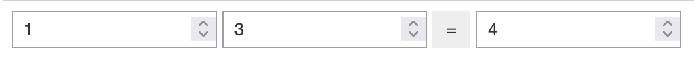

Usage
=====

.. _installation:

Installation
------------
To use sim2lbuilder, first install it using pip:

.. code-block:: console

   $ pip install sim2lbuilder

Building an App Schema
----------------------

The schema is a collection of inputs, outputs and a layout described as a Python dictionary

.. code-block:: python

    schema = {
        'inputs': { 
            'n1': { 'type': 'IntText', 'value': 1}, 
            'n2': { 'type': 'IntText', 'value': 3}
        },
        'outputs': { 
            'sol': { 'type': 'IntText'}, 
        },
        'layout': { 
            'type': 'HBox',
            'children' : {
                'n1': None,
                'n2': None,
                'button' : {
                    'type': 'Button',
                    'click': 'SUM',
                    'description': '=',
                },
                'sol': None
            }
        }
    }

The schema requires that every input be defined within a dictionary, specifying an identifier as the key, 
along with a default value and a corresponding type. The types correspond to the widget names developed
by the `Jupyter project <https://ipywidgets.readthedocs.io/en/stable/examples/Widget%20List.html>`_.
Moreover, developers have the flexibility to include additional parameters to the widgets like value boundaries or 
labels within the dictionary

Similary Outputs are described in the schema, but they dont require a default value to be passed. 
Custom widgets can be added as inputs or outputs if the required module is included. 
for example if a map is required, the following code includes the ``Map`` widget from the ``ipyleaflet`` library.

Similarly, Outputs are defined within the schema, but unlike inputs, they do not require the inclusion
of a default value. The flexibility to include custom widgets as inputs or outputs is provided, assuming the 
required module is installed.
For instance, if a map widget is required, the following code snippet demonstrates the inclusion of the ``Map`` 
widget from the ``ipyleaflet`` library. for more examples look at the examples notebooks
(`inputs <https://github.com/denphi/sim2lbuilder/blob/main/examples/inputtypes.ipynb>`_, `outputs <https://github.com/denphi/sim2lbuilder/blob/main/examples/outputtypes.ipynb>`_)

.. code-block:: python

    schema = {
        'outputs': {
            'output1' : { 
                'type': 'Map',
                'module' : 'ipyleaflet'
            }
        }
    }

The layout is a collection of dictionaries that resembles a tree-like structure. 
Each node within the tree includes an array of children, widget descriptions, or references to inputs or outputs.
Widget descriptions (e.g. ``button`` in the above schema) follow a similar format as inputs, but they are not passed as part of the widget to callback function.
References to inputs or outputs are established solely by passing the key of the respective dictionary,
while the corresponding value should be set as ``None``
containers require a type to be defined, container types are defined by the `layout type  <https://ipywidgets.readthedocs.io/en/stable/examples/Widget%20Layout.html>`_.

Building a widget
-----------------

WidgetConstructor construct a jupyter widget App based on the schema passed as parameter to the constructor, 
however there is no interaction between the widgets included in the App. callbacks are need to be added, as explained next.

>>> s = WidgetConstructor(schema)

Callbacks
---------
An App usually serves as a representation of a workflow that relies on inputs and stores results on outputs.  
This functionality is achieved through a Python function that accepts a widget as a parameter.
the widget holds references to the inputs and outputs specified in the schema, allowing the function to establish connections between input values and output results.
To illustrate this concept, consider the following function, which adds the values of inputs ``n1`` and ``n2`` and saves the solution to the output ``sol``.

>>> def SUM (w):
>>>     w.outputs["sol"].value = w.inputs["n1"].value + w.inputs["n2"].value

and the Assigning the function to replace the default dummy function created by WidgetConstructor

>>> s.SUM = SUM

Assembling your App
-------------------

Finally the widget needs to be assembled.

>>> s.assemble()
>>> display(s)

The ful code looks like the following

.. code-block:: python

    schema = {
        'inputs': { 
            'n1': { 'type': 'IntText', 'value': 1}, 
            'n2': { 'type': 'IntText', 'value': 3}
        },
        'outputs': { 
            'sol': { 'type': 'IntText'}, 
        },
        'layout': { 
            'type': 'HBox',
            'children' : {
                'n1': None,
                'n2': None,
                'button' : {
                    'type': 'Button',
                    'click': 'SUM',
                    'description': '=',
                },
                'sol': None
            }
        }
    }
    from sim2lbuilder import WidgetConstructor
    s = WidgetConstructor(schema)
    def SUM (w):
        w.outputs["sol"].value = w.inputs["n1"].value + w.inputs["n2"].value
    s.SUM = SUM
    s.assemble()
    SUM(s)
    display(s)

Exporting widgets
-----------------

The widget can be exported as a Python script by providing the ``format`` parameter as ``"file"`` when constructing the Widget. 
This will generate a Download link that allows you to obtain the file.

.. code-block:: python

    s = WidgetConstructor(schema, format="file")
    s.RunSimTool = RunSimTool
    s.assemble()
    s

The exported Python script can be imported later to render the same results.
By executing the script, you can reproduce and visualize the same outcomes

.. code-block:: python

    import MyWidget
    MyWidget.MyWidget()

